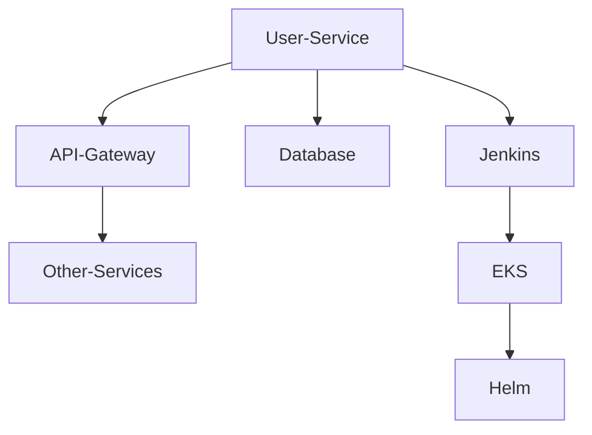

# Roboshop User Microservice CD(Continuous Deployment)

Welcome to the **User Microservice** repository for the **Roboshop Application**, a microservices-based e-commerce platform for selling robots. This repository is dedicated to the **User** service, focusing on continuous deployment (CD) automation and infrastructure.

---

## Table of Contents

- [Overview](#overview)
- [Features](#features)
- [Tech Stack](#tech-stack)
- [Architecture](#architecture)
- [CI/CD Pipeline](#cicd-pipeline)
- [Deployment](#deployment)
- [Usage](#usage)
- [Contributing](#contributing)
- [License](#license)

---

## Overview

The **User Microservice** is responsible for handling all user-related operations within the Roboshop platform, such as authentication, user data management, and account services. This repository is designed for **Continuous Deployment** (CD) and includes all necessary configurations for automated build, test, and deployment using modern DevOps tools.

---

## Features

- Microservices-based architecture
- Automated CI/CD using Jenkins and Shared Libraries
- Dockerized deployments
- Kubernetes (EKS) native deployment with Helm charts
- Scalable, secure, and production-ready

---

## Tech Stack

- **Programming Language:** Java
- **CI/CD:** Jenkins, [Jenkins Shared Library](https://github.com/BharathKumarReddy2103/jenkins-shared-library)
- **Containerization:** Docker
- **Orchestration:** Kubernetes (AWS EKS)
- **Deployment Management:** Helm

---

## Architecture

This service forms a part of the Roboshop microservices ecosystem. Each microservice is independently deployable and communicates via APIs. The CD pipeline ensures that any changes to this service are automatically tested and deployed in the EKS cluster.



---

## CI/CD Pipeline

- **Jenkinsfile:** Defines the pipeline stages (build, test, dockerize, deploy).
- **Jenkins Shared Library:** Reusable pipeline logic and best practices.
- **Dockerfile:** Builds a container image for the microservice.
- **Helm Charts:** Kubernetes manifests for deploying to EKS.

### Pipeline Flow

1. **Code Commit:** Triggered by a GitHub push/PR.
2. **Build & Test:** Jenkins runs unit/integration tests.
3. **Docker Build:** Image is built and pushed to the registry.
4. **Helm Deploy:** New version is deployed to EKS using Helm.

---

## Deployment

### Prerequisites

- Jenkins server with access to EKS and Docker registry
- AWS EKS cluster
- Helm 3.x installed
- Docker

### Steps

1. **Clone this repository:**
    ```bash
    git clone https://github.com/BharathKumarReddy2103/user-cd.git
    cd user-cd
    ```
2. **Configure Jenkins with the Shared Library:**  
   Reference the [jenkins-shared-library](https://github.com/BharathKumarReddy2103/jenkins-shared-library) in your Jenkins global libraries.

3. **Setup Credentials:**  
   Store AWS, Docker, and Kubernetes credentials in Jenkins.

4. **Run the Pipeline:**  
   The Jenkinsfile is configured to trigger on commits and pull requests.

5. **Deploy to EKS:**  
   Helm charts in the `/helm` directory are used for deployment.

---

## Usage

- **Local Development:**  
  You can run the microservice locally using Docker Compose or by running the app directly.

- **Production Deployment:**  
  All production deployments are automated via Jenkins, Docker, and Helm to AWS EKS.

---

## Contributing

Contributions are welcome. Please fork the repository and submit a pull request. For significant changes, open an issue to discuss what you would like to change.

---

## License

This project is licensed under the MIT License.
